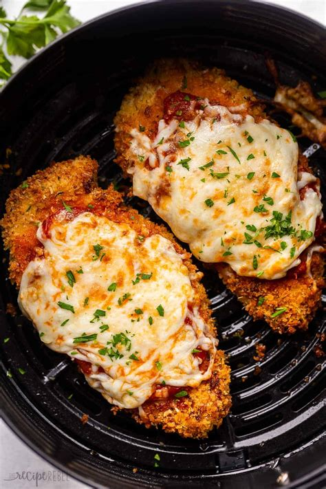

# Parmesan Chicken
0001

## Ingredients

- 1/2 tsp salt
- 1/4 tsp pepper
- 1/4 tsp garlic powder
- 1 tbsp dried parsley
- 1/4 cup melted butter
- 1/4 tsp paprika
- 1/4 tsp thyme
- 1/2 cup parmesan cheese
- 1/2 cup seasoned bread crumbs
- 6 chicken breasts
- 1 tbsp oil (for pan)
- 1/3 cup water (for pan)

## Instructions

1. Mix seasoned bread crumbs, parmesan cheese, and seasonings (salt, pepper, garlic powder, dried parsley, paprika, and thyme) in a bag.
2. Add chicken to the bag and shake to coat evenly.
3. In a 9 x 13-inch baking pan, add 1 tbsp oil and 1/3 cup water.
4. Arrange the coated chicken breasts in the pan.
5. Top the chicken with any remaining crumb mixture and drizzle melted butter on top.
6. Bake at 350°F (175°C) for 45 minutes.
