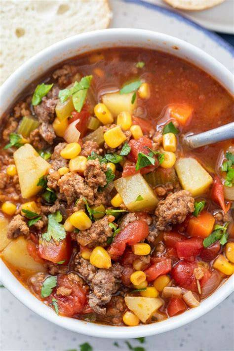

# Hamburger Soup
0002

## Ingredients

- 1 1/2 lb hamburger
- 1/2 tsp garlic salt
- 1 tsp chili powder
- 4 tbsp butter
- 1 onion, chopped fine
- 1 cup celery, diced fine
- 2 cups potatoes, peeled and diced
- 4 cups water
- 2 cans vegetable beef soup
- 1 can northern beans
- 1 (12 oz) can spicy V-8 juice
- Salt and pepper to taste

## Instructions

1. Cook and crumble hamburger in a large soup pan until nice and brown.
2. Add garlic salt, chili powder, butter, celery, and onions; sauté for a couple minutes.
3. Add water, potatoes, canned soups, beans, and V-8 juice.
4. Simmer for about 2 hours.
5. Season with salt and pepper to taste.

*Note: Leftovers freeze well. Serve topped with freshly grated parmesan cheese.*
