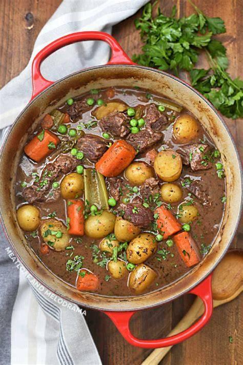

# Beef Stew
0003

## Ingredients

- 2 lb beef cubes
- 1 sliced onion
- 3 cloves Garlic
- 4 cups boiling water
- 1 tbsp salt
- 1 tbsp lemon juice
- 1 tsp sugar
- 1 tsp Worcestershire sauce
- 1/2 tsp pepper
- 1/2 tsp paprika
- 1 dash allspice
- 2 medium carrots
- 2 potatoes
- 1/2 sliced onion for after

## Instructions

1. Brown 2 lb beef cubes.
2. Add sliced onion, garlic, 4 cups boiling water, salt, lemon juice, sugar, Worcestershire sauce, pepper, paprika, and a dash of allspice.
3. Simmer for 2 hours.
4. When meat is almost done, add carrots, potatoes, and onions.
5. Make gravy with liquid when finished.
