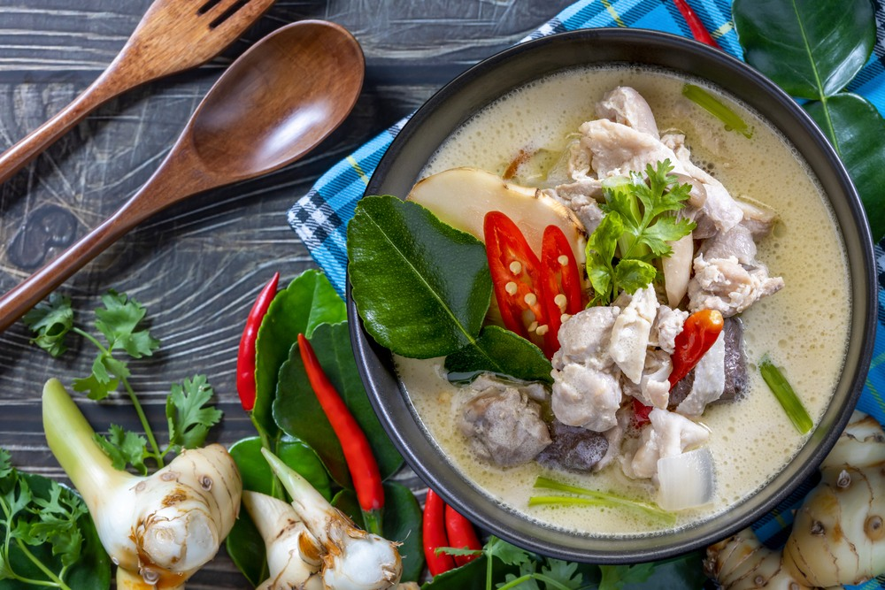

# Singapore Chicken Stew
0006

## Ingredients

- 1 lb chicken
- 1/2 tsp Chinese five spice
- 1/2 tsp hot chili flakes
- 1/2 tsp salt
- 1 tbsp vegetable oil
- 2 cloves minced garlic
- 1 tbsp grated ginger
- 2 (13 1/2 oz) cans coconut milk
- 2 (14 1/2 oz) cans chicken broth
- 1 to 2 heads bok choy, chopped
- 1/4 cup water chestnuts
- 3 tbsp cilantro
- 1/2 cup mushrooms, sliced
- 2 roma tomatoes, chopped
- 1 tbsp lime juice
- 1/4 cup green onions, sliced

## Instructions

1. Cook chicken, shred.
2. In a 5-quart pan, combine oil, garlic, & ginger. Heat until fragrant.
3. Add coconut milk, broth, chicken. Simmer.
4. Stir in all remaining ingredients.
5. Cook for approximately 5 minutes.
6. Serve!
