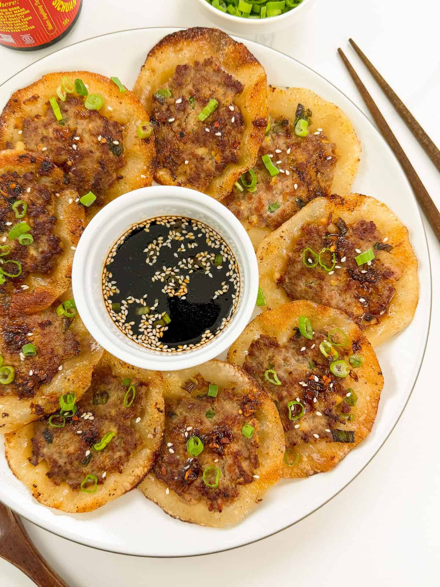

# Smashed Lemongrass Pork Dumplings
0008

## Ingredients

### Smashed Dumplings

- 1 lb ground pork
- 1 napa leaf, finely chopped
- 3 cloves garlic, minced
- 1 tbsp minced ginger
- 2 tbsp minced lemongrass
- 2 green onions, finely chopped
- 3 tbsp soy sauce
- 2 tsp granulated sugar
- 1 1/2 tbsp oyster sauce
- 1 tsp sesame oil
- 1/4 tsp salt
- Dash of white pepper
- 25 round dumpling wrappers
- Neutral oil for frying

### Dumpling Sauce

- 3 tbsp soy sauce
- 1 tbsp Chinese black vinegar
- 1/2 tsp granulated sugar
- 1 tbsp chili crisp

## Instructions

1. **Make the Filling:** In a large bowl, combine ground pork, chopped napa cabbage, garlic, ginger, lemongrass, green onions, 3 tbsp soy sauce, 2 tsp sugar, oyster sauce, sesame oil, salt, and white pepper. Mix well until everything is evenly incorporated.
2. **Assemble & Smash:** Place a round dumpling wrapper on a flat surface and spoon about 1 to 1 1/2 tbsp filling into the center. Smash it down with the back of the spoon or flatten with the palm of your hand. Repeat with the remaining wrappers and filling.
3. **Pan-Fry:** Heat 1 to 2 tbsp neutral oil in a large skillet over medium heat. Cook the dumplings meat-side down for about 2 minutes until cooked through, then flip and fry the wrapper-side for another 2 minutes until golden and crispy. Cook in batches to avoid overcrowding the pan.
4. **Make Sauce & Serve:** In a small bowl, whisk together 3 tbsp soy sauce, Chinese black vinegar, 1/2 tsp sugar, and chili crisp until combined. Serve warm as a dipping sauce on the side.
