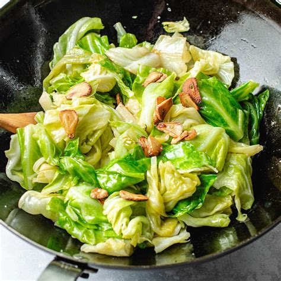

# Din Tai Fung Taiwanese Cabbage with Garlic
0009

## Ingredients

- 1 small head Taiwanese cabbage (about 1 to 1 1/2 lb)
- 10 cloves garlic
- 1/4 cup neutral oil
- 1 tsp kosher salt (plus more to taste)
- 2 tbsp Shaoxing wine
- 1/2 tsp white pepper
- 1/2 tbsp chicken bouillon powder
- 1 tsp sesame oil (optional)

## Instructions

1. **Prep the Cabbage & Garlic:** Cut the cabbage in half and remove the inner core with a sharp knife. Cut the cabbage into 2 to 3-inch pieces and separate the layers. Thinly slice the garlic into 1/8-inch thick slices.
2. **Sauté Garlic & Cabbage:** Heat 1/4 cup neutral oil in a large wok or deep skillet over high heat. Add the sliced garlic and sauté until light golden brown (about 10 seconds), then immediately add the cabbage and salt. Stir-fry for 3 to 4 minutes until there is no visible water pooling at the bottom of the pan. Cook off and evaporate this moisture to prevent soggy cabbage.
3. **Season & Finish:** Once excess water is cooked off, pour the Shaoxing wine around the outer edge of the pan. Stir-fry until the wine dissolves, then add the white pepper and chicken bouillon powder. Continue stir-frying for another 3 to 4 minutes until the cabbage is slightly wilted but still crisp. Drizzle with optional sesame oil and serve warm.

## Notes

- **Avoiding Sogginess:** Cooking out the water drawn out by the salt in Step 2 is essential. Pushing the cabbage to the side of the pan allows the direct heat to evaporate pooling liquid before adding seasonings.
