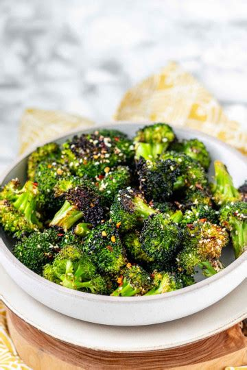

# 5-Ingredient Sesame Broccoli
0010

## Ingredients

- 1 cup broccoli (or 2 medium-sized heads)
- 1/2 tsp salt
- 1/2 tsp garlic
- 1 tbsp sesame oil
- 1 tbsp sesame seeds

## Instructions

1. Cook the broccoli (steam, boil, or sauté to your preferred tenderness).
2. Toss the warm broccoli with the salt, garlic, sesame oil, and sesame seeds until evenly coated.
