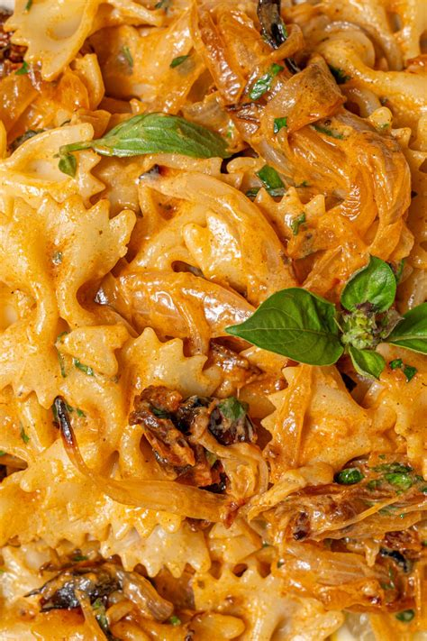

# One Pan Caramelized Onion Pasta
0011

## Ingredients

- 5 small yellow onions, sliced (or 3 large yellow onions)
- 1 head garlic, top sliced off
- 1/2 cup sun-dried tomatoes, chopped
- 1 tsp salt
- 1 tsp black pepper
- 1 tbsp paprika
- 1 tsp dried parsley
- 1/2 cup coconut milk
- 3 cups farfalle pasta, cooked
- 1 handful fresh parsley, chopped
- 1 handful fresh basil, chopped
- 1 lemon, juiced
- Olive oil (or oil from the sun-dried tomato jar) for drizzling

## Instructions

1. **Prep & Bake Base:** Preheat oven to 400°F (200°C). To a casserole dish, add the sliced onions, chopped sun-dried tomatoes, paprika, salt, black pepper, and dried parsley. Toss together, then place the head of garlic in the middle. Drizzle the entire dish with olive oil (or leftover sun-dried tomato oil), cover tightly with foil, and bake for 1 hour, tossing halfway through until onions are caramelized.
2. **Cook Pasta:** About 20 minutes before the onion mixture is finished baking, cook the farfalle pasta according to package directions. Reserve up to 1 cup pasta water before draining.
3. **Assemble & Serve:** Remove the dish from the oven. When safe to handle, squeeze out the roasted garlic cloves into the casserole dish. Add the fresh parsley, fresh basil, lemon juice, coconut milk, cooked farfalle pasta, and reserved pasta water (as needed for desired sauce consistency). Stir well to combine and serve warm!
