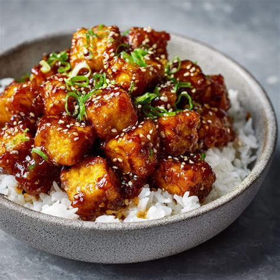

# Crispy Honey Soy Garlic Tofu Bowl
0012

## Ingredients

### Main

- 1 block extra firm tofu
- 2 tbsp cornstarch
- 3 tbsp neutral cooking oil, divided (e.g., avocado oil)
- 1 shallot, thinly sliced

### Sauce

- 2 garlic cloves, minced
- 3 tbsp soy sauce
- 2 tbsp honey
- 1/2 tbsp rice vinegar (or lemon juice)
- 1/2 tsp freshly grated ginger

### For the Bowl

- Broccoli
- 1 garlic clove, minced
- 1 tbsp neutral oil
- Pinch of salt
- 1 cup cooked rice

### Optional Garnishes

- Toasted sesame seeds
- Sliced spring onion
- Chili oil

## Instructions

1. **Blanch the Broccoli:** Add the broccoli to boiling water and cook for 1 minute. Immediately submerge it in ice water to stop the cooking process (this keeps it crisp).
2. **Prep Sauce & Shallot:** Thinly slice the shallot. Whisk all sauce ingredients together in a bowl until combined.
3. **Prep & Coat Tofu:** Strain and pat the tofu dry with a towel. Slice into cubes, then toss with cornstarch until all sides are evenly coated.
4. **Crisp the Tofu:** Heat 1 tbsp oil in a pan over medium-high heat until hot. Fry the tofu in 2 batches (adding 1 tbsp oil for the second batch), turning so all sides get brown and crispy (about 7 minutes total). Transfer tofu to a plate and set aside.
5. **Cook Sauce:** In the same pan, add the remaining 1 tbsp oil and reduce heat to medium-low. Sauté the sliced shallot until soft. Pour in the sauce mixture and cook until slightly reduced (1–2 minutes).
6. **Glaze Tofu:** Increase heat to medium, return the tofu to the pan, and toss until evenly coated. Remove the tofu and set aside, reserving any leftover sauce in the pan.
7. **Stir-Fry Broccoli:** Turn heat to high in the same pan with the leftover sauce. Add 1 tbsp oil and stir-fry the minced garlic until fragrant (~30 seconds). Add the blanched broccoli and a pinch of salt, tossing quickly until lightly browned (1–2 minutes).
8. **Assemble & Serve:** Serve the glazed tofu and broccoli over cooked rice. Top with extra sauce and garnish with sliced spring onions, toasted sesame seeds, and chili oil if desired.
