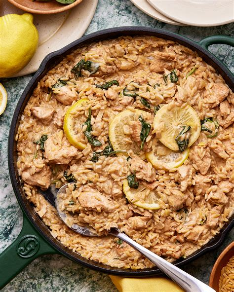

# Creamy Lemon Chicken Orzo 🍋
0013

## Ingredients

- 2 lbs chicken breasts
- Olive oil (for coating chicken)
- Equal parts: Garlic & Herb seasoning, Smoked paprika, and Lemon pepper seasoning
- 4 tbsp butter
- 1 small onion, diced
- 2 cups dry orzo
- 3 1/2 cups chicken stock
- Garlic, salt, & pepper (to taste)
- 1–2 tbsp Dijon mustard
- 1/4 cup heavy cream
- 1/2 cup freshly grated Parmesan
- Juice of 1/2 lemon
- Fresh parsley, chopped

## Instructions

1. **Season Chicken:** Drizzle chicken breasts with olive oil and season generously with equal parts Garlic & Herb seasoning, smoked paprika, and lemon pepper.
2. **Sear Chicken:** In a large skillet, sear the chicken on both sides until browned, then remove and set aside. *(Note: The chicken will not be fully cooked through yet).*
3. **Sauté Aromatics:** Add butter and diced onion to the skillet. Cook until the onion begins to soften, scraping up any browned bits from the bottom of the pan.
4. **Build the Orzo Base:** Stir in the dry orzo, chicken stock, and Dijon mustard. Season with garlic, salt, and pepper to taste. Bring the mixture to a boil.
5. **Add Chicken:** Dice the seared chicken into bite-sized pieces and return it to the skillet.
6. **Simmer:** Reduce heat to low, cover, and simmer for 10–12 minutes (stirring occasionally) until the orzo is tender and the chicken is fully cooked through.
7. **Finish Sauce:** Remove from heat and stir in the heavy cream, freshly grated Parmesan, and lemon juice.
8. **Garnish & Serve:** Top with fresh parsley and serve warm!
