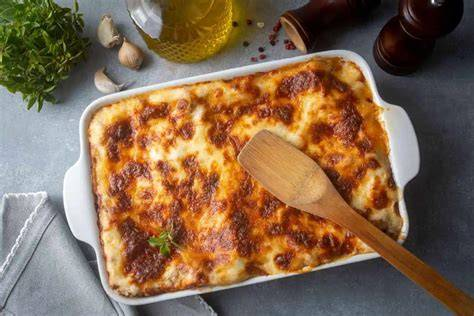

# Meatball Lasagna
0014

## Ingredients

- 1 jar marinara sauce (24–25 oz)
- 1 1/4 cups water
- 8–10 oven-ready lasagna noodles, broken into pieces
- 1 cup whole milk ricotta
- 2 cups shredded whole milk mozzarella, divided
- 20–25 frozen fully cooked meatballs (1/2 oz size)
- 1 cup frozen chopped spinach
- 1 tsp Italian seasoning
- 1/2 tsp garlic powder
- Pinch of salt

## Instructions

1. **Mix Base:** In a 9x13-inch baking dish, mix together the marinara sauce, water, ricotta, Italian seasoning, garlic powder, and a pinch of salt.
2. **Combine Ingredients:** Add the broken lasagna noodles, frozen meatballs, frozen spinach, and 1 cup shredded mozzarella (half). Stir everything together and press the noodles down into the sauce so they are fully submerged.
3. **Top & Cover:** Top evenly with the remaining 1 cup mozzarella cheese and cover tightly with foil.
4. **Bake:** Bake at 375°F (190°C) covered for 45–50 minutes, then remove the foil and bake uncovered for another 10–15 minutes until bubbly and the cheese is browned.
5. **Rest & Serve:** Let rest for 10 minutes before scooping and serving.
