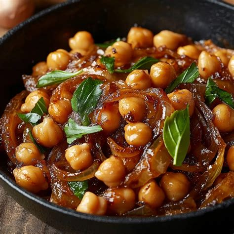

# Harissa Chickpeas
0015

## Ingredients

- 2 tsp oil
- 1 medium onion, thinly sliced (about 1 1/2 cups)
- 1 tsp balsamic vinegar
- 1/2 tsp salt (divided, or more to taste)
- 1 tbsp garlic paste (or 4 cloves garlic, minced)
- 1 tsp smoked paprika
- 2 tbsp harissa paste *(see notes for less spice)*
- 1/2 tsp dried oregano
- 2 cups chopped leafy greens of choice (packed, e.g., Swiss chard, spinach, or mustard greens)
- 1 (15 oz) can chickpeas, drained (or 1 1/2 cups cooked chickpeas or white beans)
- 1 cup full-fat coconut milk or coconut cream *(use full can for extra sauce)*
- Lemon juice, cilantro, and black pepper for garnish

## Instructions

1. **Caramelize Onions:** Heat a large skillet over medium heat. Add oil, thinly sliced onion, and 1/4 tsp salt. Cook for 7–9 minutes, stirring occasionally (add 2–3 tsp water if the pan gets too dry to help brown evenly). Once onions are translucent and starting to turn golden, add the balsamic vinegar and cook for another 3–4 minutes.
2. **Sauté Spices & Garlic:** Add garlic, smoked paprika, harissa, and oregano to the pan. Mix well and cook for 1 minute until garlic is fragrant.
3. **Simmer:** Add the leafy greens, remaining 1/4 tsp salt, chickpeas, and coconut milk/cream. Stir well, partially cover, and simmer for 8–10 minutes.
4. **Adjust & Thicken:** Taste and adjust seasonings. Add a squeeze of lemon juice, and if a thicker sauce is desired, stir in 1–2 tbsp non-dairy yogurt or sour cream (or add more non-dairy milk if you prefer it saucier). Simmer for 1–2 more minutes.
5. **Garnish & Serve:** Remove from heat and garnish with cilantro or parsley, black pepper, and extra lemon juice. Serve warm with flatbread, rice, sourdough toast, or garlic bread.

## Notes

- **Less Spicy Option:** Reduce or omit harissa paste and smoked paprika. Add 1 tbsp tomato paste, chopped red bell pepper, and extra oregano or thyme.
- **Coconut Milk Substitutes:** Replace coconut milk with 1 to 1 1/2 cups cashew milk or oat milk, or blend 1/4 cup silken/firm tofu with 3/4 cup water. A mix of non-dairy yogurt and non-dairy milk also works well for a thick sauce.
