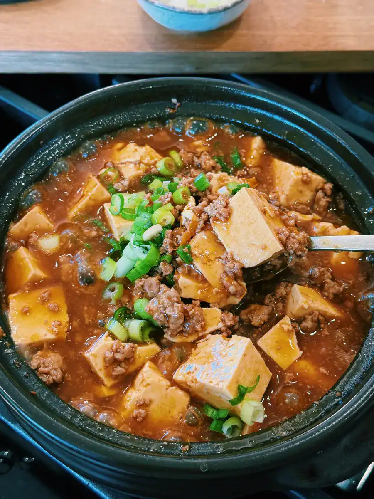

# Protein Spicy Garlic Tofu & Pork
0017

## Ingredients

- 400 g ground pork or chicken
- 1 tbsp garlic oil
- 3 tbsp scallion sauce
- 1 1/2 tbsp chili oil, adjusted to taste
- 1 1/2 tbsp vegetarian oyster sauce
- 1 block medium or firm tofu (about 400 g), cubed
- 1 cup chicken stock, or other stock

### Cornstarch Slurry

- 1 tbsp cornstarch
- 2 tbsp water

### Optional Garnish

- Green onions, chopped
- Red chili, chopped
- Steamed rice, for serving

## Instructions

1. **Brown the Meat:** Heat a pan over medium-high heat. Add the ground pork and saute for 5-6 minutes, until browned and cooked through.
2. **Season:** Stir in the garlic oil, scallion sauce, chili oil, and vegetarian oyster sauce. Saute for 2-3 minutes to deepen the flavor.
3. **Add Tofu and Stock:** Gently fold in the cubed tofu without breaking it up. Pour in the stock, bring to a gentle simmer, and cook for 5 minutes.
4. **Thicken the Sauce:** Mix the cornstarch and water in a small bowl. Stir the slurry into the pan and cook for 1-2 minutes, until the sauce is silky and thickened.
5. **Serve:** Spoon over steamed rice and garnish with extra chili oil, red chili, or green onions, if desired.

## Notes

- Recipe adapted from [Tiffy Cooks](https://tiffycooks.com/high-protein-spicy-garlic-tofu-with-ground-pork/).
