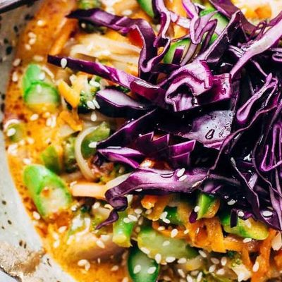

# Coconut Curry Noodle Bowls
0018

## Ingredients

### Coconut Curry Sauce

- 1 tbsp oil
- 2 shallots, chopped
- 1 tbsp fresh ginger, minced
- 2 tbsp red curry paste
- 1 (14 oz) can regular coconut milk
- 1/2 cup reduced-sodium chicken or vegetable broth (optional)
- 3 tbsp sugar
- 1 tbsp hot chili paste, such as sambal oelek
- 2 tbsp fish sauce
- 2 tbsp soy sauce

### Noodle Bowls

- 4 oz rice noodles
- 1 tbsp oil
- 1/2 onion, chopped
- 1 cup broccoli florets, chopped
- 1 cup shredded carrots
- 1 cup asparagus, chopped
- 1 cup shredded purple cabbage
- Sesame seeds, for topping
- Lime wedges and fresh basil, for serving

## Instructions

1. **Soak the Noodles:** Soak the rice noodles in cold water for at least 20 minutes, until soft. Drain and rinse.
2. **Make the Sauce:** Heat 1 tbsp oil in a saucepan. Stir-fry the shallots and ginger for 3-5 minutes, then add the curry paste and cook for 1 minute. Add the coconut milk, optional broth, sugar, chili paste, fish sauce, and soy sauce. Simmer for about 15 minutes, until slightly thickened.
3. **Cook the Vegetables:** Heat 1 tbsp oil in a large skillet over high heat. Add the onion, carrots, broccoli, and asparagus; stir-fry for about 5 minutes, until the broccoli and asparagus are bright green.
4. **Finish the Bowls:** Add the drained noodles and toss with the vegetables. Add the curry sauce and toss just until combined.
5. **Serve:** Top with purple cabbage, sesame seeds, fresh basil, and a squeeze of lime.

## Notes

- Add the broth for a saucier, more soup-like curry; omit it for a thicker sauce that clings to the noodles.
- For a vegetarian or vegan version, use vegetarian curry paste, vegetable broth, and a vegan fish sauce alternative or additional soy sauce.
- Recipe adapted from [Pinch of Yum](https://pinchofyum.com/bangkok-coconut-curry-noodle-bowls).
