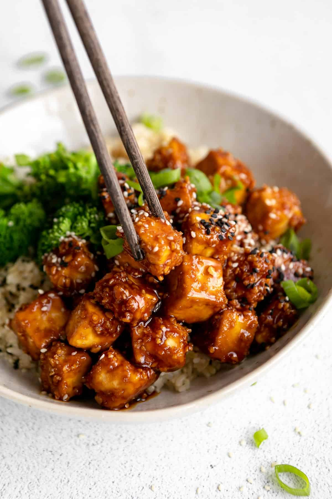

# Garlic Sesame Tofu
0019

## Ingredients

### Tofu

- 1 (16 oz) block extra-firm tofu
- 1 tbsp low-sodium tamari or soy sauce
- 1 tbsp cornstarch
- 3 tbsp gluten-free breadcrumbs (or regular breadcrumbs)

### Garlic Sesame Sauce

- 5 cloves garlic, minced
- 1 tbsp oil, such as avocado oil
- 1/3 cup low-sodium tamari or soy sauce
- 2 tsp toasted sesame oil
- 2-3 tbsp honey or maple syrup
- 1 tbsp rice vinegar
- 1 tbsp cornstarch
- 4 tbsp water, divided
- Sesame seeds, for serving (optional)
- Cooked rice and steamed broccoli, for serving (optional)

## Instructions

1. **Prepare the Oven:** Preheat the oven to 400°F and line a baking sheet with parchment paper.
2. **Coat the Tofu:** Drain and dry the tofu, then cut it into 1-inch cubes. Toss the cubes with 1 tbsp soy sauce, followed by the cornstarch and breadcrumbs, until evenly coated.
3. **Bake the Tofu:** Arrange the tofu on the prepared baking sheet and bake for 30-35 minutes, until golden brown.
4. **Start the Sauce:** During the final 10 minutes of baking, saute the garlic in 1 tbsp oil in a small pan for 2-3 minutes, until lightly browned.
5. **Season the Sauce:** Add the 1/3 cup soy sauce, sesame oil, honey or maple syrup, rice vinegar, and 2 tbsp water.
6. **Thicken the Sauce:** Whisk the cornstarch with the remaining 2 tbsp water, then stir it into the pan. Cook over low heat for 3-5 minutes, until bubbling and thickened.
7. **Finish and Serve:** Toss the baked tofu with the sauce. Garnish with sesame seeds and serve on its own or over rice with steamed broccoli.

## Notes

- Pressing the tofu is optional, but it will make the finished tofu crispier.
- If using regular rather than low-sodium soy sauce, add a little extra water so the sauce is not overly salty.
- Recipe adapted from [Eat With Clarity](https://eatwithclarity.com/sheet-pan-sesame-tofu-vegetables/).
