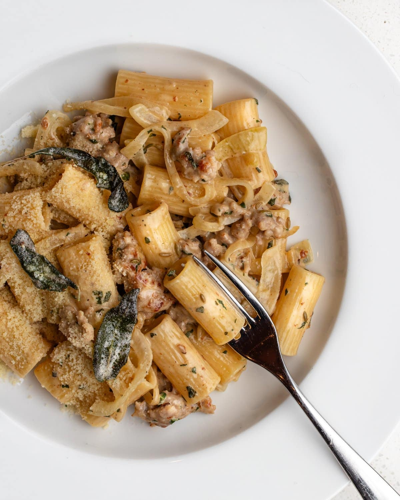

# Creamy Sausage Pasta
0020

## Ingredients

- 200 g dried pasta
- 2 tbsp butter, divided
- 1/2 large yellow or brown onion, thinly sliced
- 220 g sausages (about 3), casings removed
- 1 1/2 tbsp fresh sage leaves, roughly chopped
- 1/2 tsp fennel seeds (optional)
- 3/4 cup cream
- 1/2 tsp black pepper
- 50 g Parmesan, finely grated
- 1 tbsp fresh lemon juice
- Salt, to taste
- Lemon zest and extra Parmesan, for serving

## Instructions

1. **Cook the Pasta:** Cook the pasta in a large pot of well-salted water until 1 minute short of the package directions. Reserve some pasta water before draining.
2. **Soften the Onion:** Melt 1 tbsp butter in a large skillet over medium heat. Cook the onion for 5-6 minutes, adding a pinch of salt halfway through, until soft and translucent but not browned. Transfer it to a plate.
3. **Brown the Sausage:** Melt the remaining 1 tbsp butter over medium-high heat. Add the sausage meat, break it up with a wooden spoon, and cook for 3-4 minutes, until browned and cooked through.
4. **Add the Herbs:** Stir in the sage and optional fennel seeds; cook for 30-60 seconds.
5. **Make the Sauce:** Reduce the heat, push the sausage to one side, and pour in the cream. Keep it at a very gentle simmer without boiling.
6. **Add the Cheese:** Whisk the Parmesan into the cream in two batches, allowing each batch to melt before adding the next. Whisk in the black pepper and lemon juice.
7. **Finish the Pasta:** Add the drained pasta and cooked onion to the skillet. Toss and simmer gently for 1-2 minutes. Season with salt and loosen with a splash of pasta water if needed.
8. **Serve:** Top with lemon zest and extra Parmesan.

## Notes

- Serves 2; double the recipe for 4 people.
- Pork and fennel sausage works especially well, but any preferred sausage can be used. Omit the fennel seeds if they do not suit the sausage.
- For fresh pasta, use 300 g instead of 200 g dried pasta.
- The lemon balances the rich sauce. Reduce it to 1/2 tbsp or omit it if preferred; add it after the pasta if you are concerned about the cream curdling.
- Recipe adapted from [The Burnt Butter Table](https://www.theburntbuttertable.com/best-creamy-sausage-pasta-recipe/).
