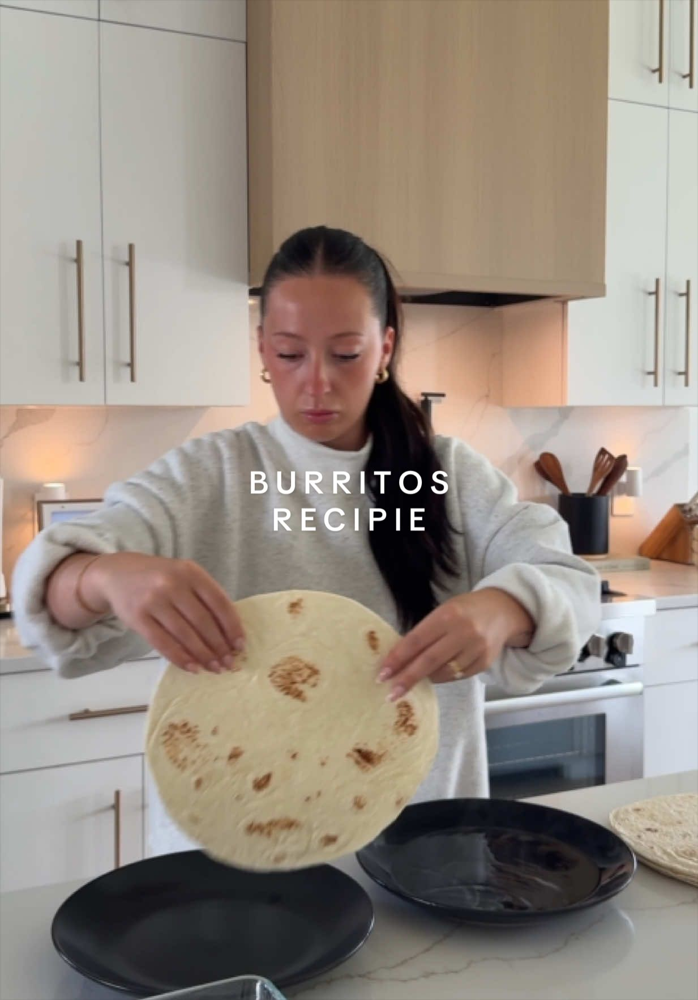

# Creamy Chicken Burritos
0025

## Ingredients

- 1 package chicken breasts or tenders, cooked and shredded
- 1 package cream cheese, softened
- 1/2 jar salsa
- 3/4 can sweet corn, drained
- 1 can mild green chile peppers
- 6 large burrito-size tortillas
- 1 cup heavy cream
- Shredded Monterey Jack cheese

## Instructions

1. **Heat the oven:** Preheat the oven to 350 F. Grease a baking dish.
2. **Make the filling:** Mix the shredded chicken, cream cheese, salsa, corn, and green chiles in a large bowl.
3. **Fill the burritos:** Briefly wet each tortilla on both sides with hot water, shake off the excess, then add 1/2 to 3/4 cup filling. Fold in the sides and roll.
4. **Bake:** Place the burritos in the baking dish. Pour the heavy cream over the tops and cover with Monterey Jack. Bake uncovered for 25 to 30 minutes.

## Notes

- Makes about 6 burritos.
- Refrigerate for 3 to 4 days or freeze for up to 3 months.
- Source: Sydney Slone on TikTok, https://www.tiktok.com/t/ZTUDv5fME/
