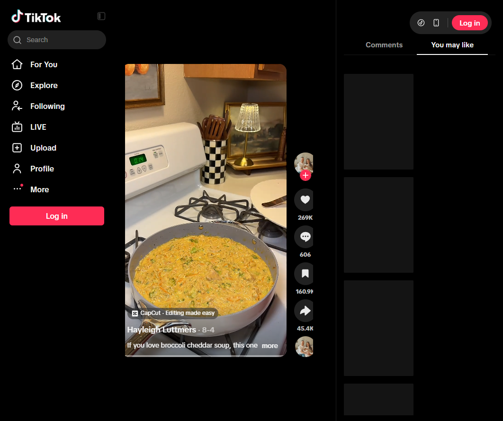

# Chicken Broccoli Cheddar Orzo
0027

## Ingredients

- 2 chicken breasts, cut into bite-size pieces
- 1 tablespoon olive oil
- 1 onion, diced
- 1 carrot, grated
- 2 tablespoons butter
- 1 tablespoon minced garlic
- 1 cup orzo
- 2 1/2 cups chicken stock
- 1 tablespoon chicken bouillon
- 2 cups chopped broccoli
- 1/2 cup heavy cream
- 8 ounces freshly grated cheddar cheese
- Garlic powder, onion powder, paprika, salt, and black pepper, to taste

## Instructions

1. **Cook the chicken:** Heat the olive oil in a large pot over medium-high heat. Season the chicken with garlic powder, onion powder, paprika, salt, and pepper. Cook through, then set aside.
2. **Saute the vegetables:** Melt the butter in the pot. Cook the onion and carrot for about 5 minutes, then stir in the garlic and cook for 2 minutes. Season to taste.
3. **Cook the orzo:** Add the stock, orzo, and bouillon. Bring to a boil and cook uncovered for 5 minutes, stirring occasionally.
4. **Add broccoli:** Add the broccoli, cover, and cook for 5 minutes.
5. **Finish:** Return the chicken to the pot. Stir in the cream and cheddar until smooth. Cover and cook over low heat for about 5 minutes, until the orzo is tender.

## Notes

- Source: Hayleigh Luttmers on TikTok, https://www.tiktok.com/t/ZTUD799fj/