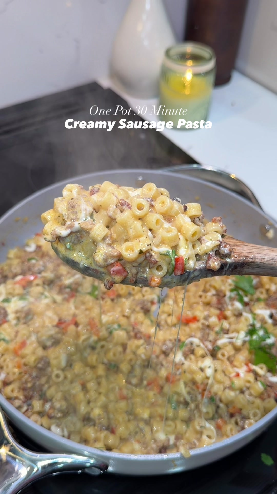

# One-Pan Creamy Sausage Pasta
0028

## Ingredients

- 1 pound Italian sausage, hot, mild, or sweet
- 1/2 pound ditalini pasta
- 1 small onion, finely diced
- 1 red bell pepper, finely diced
- 1 tablespoon minced garlic
- 1 teaspoon Italian seasoning
- 1 teaspoon garlic powder
- 1 teaspoon paprika
- 1/2 teaspoon onion powder
- 1/2 teaspoon salt, plus more to taste
- 1/4 teaspoon black pepper
- 1 1/2 cups heavy cream
- 1 cup chicken broth
- 1/2 cup grated Parmesan cheese
- 1/2 to 1 cup reserved pasta water, as needed
- 1/2 cup shredded mozzarella
- Fresh parsley, optional

## Instructions

1. **Brown the sausage:** Cook the sausage in a large skillet over medium-high heat, breaking it apart. Remove when cooked through.
2. **Cook the aromatics:** Add the onion and bell pepper to the skillet and cook over medium heat for 2 to 3 minutes. Add garlic, Italian seasoning, garlic powder, paprika, onion powder, salt, and pepper; cook for 30 seconds.
3. **Make the sauce:** Add the cream and chicken broth. Bring to a gentle simmer and cook for 8 to 10 minutes, until thickening.
4. **Cook the pasta:** Meanwhile, cook the ditalini according to package directions, reserving 1 cup pasta water before draining.
5. **Combine:** Return the sausage to the sauce with the pasta and Parmesan. Add pasta water a little at a time as needed.
6. **Serve:** Top with mozzarella and parsley, let the cheese melt, and serve.

## Notes

- Source: Nicki Mejia on TikTok, https://www.tiktok.com/t/ZTUD7ukLo/
