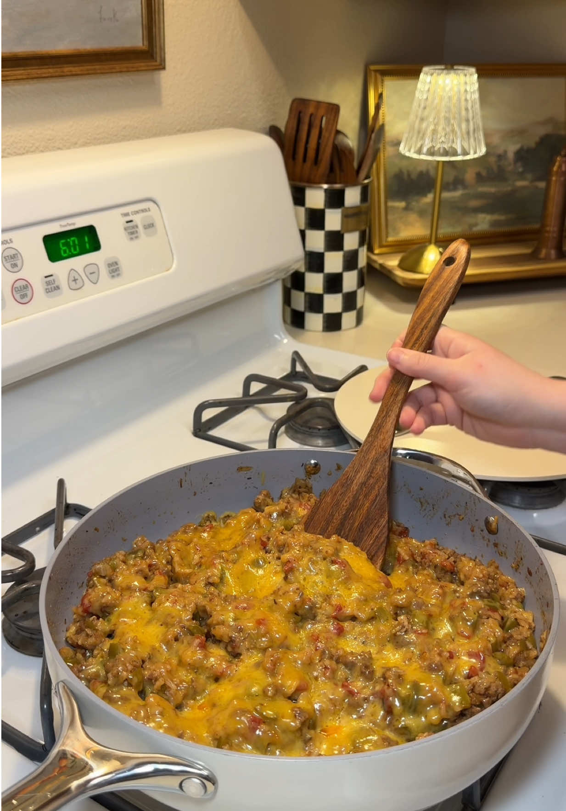

# One-Pot Unstuffed Peppers
0029

## Ingredients

- 2 tablespoons olive oil
- 1 onion, chopped
- 4 green bell peppers, chopped
- 1 tablespoon minced garlic
- 1 pound ground beef
- 1 tablespoon Worcestershire sauce
- 1 cup rice, washed
- 2 cups chicken broth
- 1 tablespoon beef bouillon
- 1 15-ounce can diced tomatoes
- 1 cup freshly grated cheddar cheese
- Garlic powder, onion powder, salt, pepper, chili powder, paprika, oregano, parsley, and seasoned salt, to taste

## Instructions

1. **Cook the vegetables:** Heat the olive oil in a large pan over medium heat. Cook the onion and peppers for 5 to 7 minutes, until softened.
2. **Brown the beef:** Stir in the garlic and ground beef. Add Worcestershire sauce and season to taste. Cook until browned.
3. **Simmer:** Add the diced tomatoes, chicken broth, beef bouillon, and washed rice. Cover and cook over medium-low heat for about 20 minutes, until the rice is tender and has absorbed the liquid.
4. **Add cheese:** Sprinkle cheddar over the top. Cover for 2 minutes, until melted, then serve.

## Notes

- Source: Hayleigh Luttmers on TikTok, https://www.tiktok.com/t/ZTUD7bFXe/
