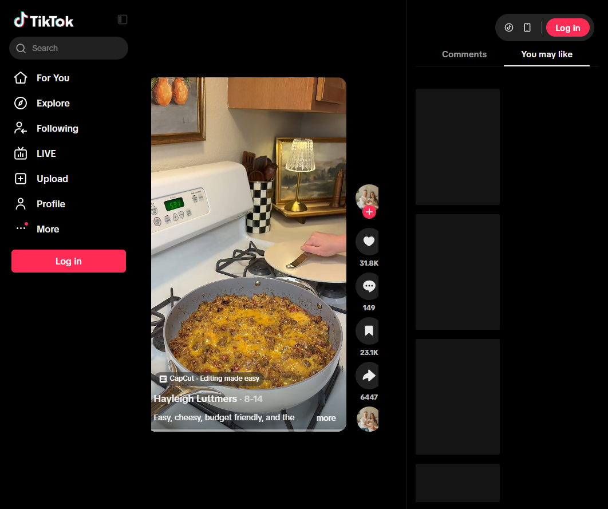

# One-Pot Taco Rice
0030

## Ingredients

- 2 tablespoons olive oil
- 1 onion, chopped
- 1 pound ground beef
- 1 packet taco seasoning
- 1 cup white rice, rinsed
- 2 cups beef broth
- 1 can Rotel
- 1 cup freshly grated cheddar cheese
- Sour cream, for topping
- Taco sauce, for topping

## Instructions

1. **Cook the beef:** Heat olive oil in a large skillet over medium heat. Cook the onion until softened, then add the beef and brown it, breaking it up. Drain excess grease if needed.
2. **Add rice and broth:** Stir in taco seasoning, Rotel, beef broth, and rinsed rice.
3. **Simmer:** Bring to a simmer, cover, and cook over medium-low heat for about 20 minutes, until the rice is tender and the liquid is absorbed.
4. **Melt the cheese:** Sprinkle cheddar evenly over the top. Cover for 2 minutes, until melted.
5. **Serve:** Serve warm with sour cream and taco sauce.

## Notes

- Source: Hayleigh Luttmers on TikTok, https://www.tiktok.com/t/ZTUD7hTdu/