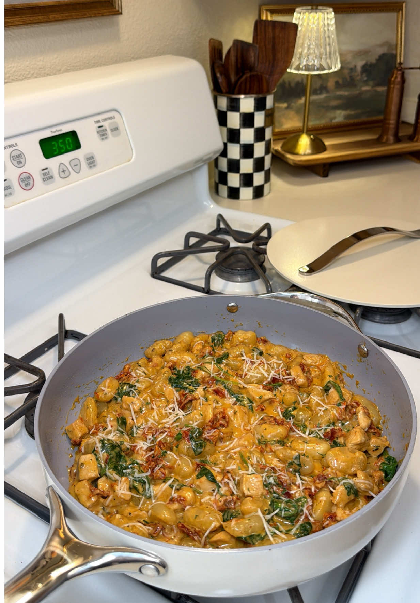

# One-Pot Marry Me Chicken Gnocchi
0031

## Ingredients

- 2 boneless, skinless chicken breasts, diced
- 2 tablespoons olive oil
- 1 tablespoon minced garlic
- Italian seasoning, paprika, salt, pepper, onion powder, and garlic powder, to taste
- 1 cup chicken broth
- 1 cup heavy cream
- 1/2 cup chopped sun-dried tomatoes
- 1 pound potato gnocchi
- 1/2 cup freshly grated Parmesan
- 2 cups fresh spinach
- Crushed red pepper flakes, to taste

## Instructions

1. **Cook the chicken:** Heat olive oil in a large skillet over medium-high heat. Season the chicken and cook until browned and cooked through.
2. **Build the sauce:** Add garlic and cook for 30 seconds. Add broth, cream, sun-dried tomatoes, and red pepper flakes. Season again to taste and stir.
3. **Cook the gnocchi:** Add the uncooked gnocchi. Bring to a gentle simmer and cook for 5 to 7 minutes, stirring occasionally, until tender and the sauce has thickened.
4. **Finish:** Stir in Parmesan until melted, then stir in spinach until wilted.

## Notes

- Source: Hayleigh Luttmers on TikTok, https://www.tiktok.com/t/ZTUD72Vvo/
