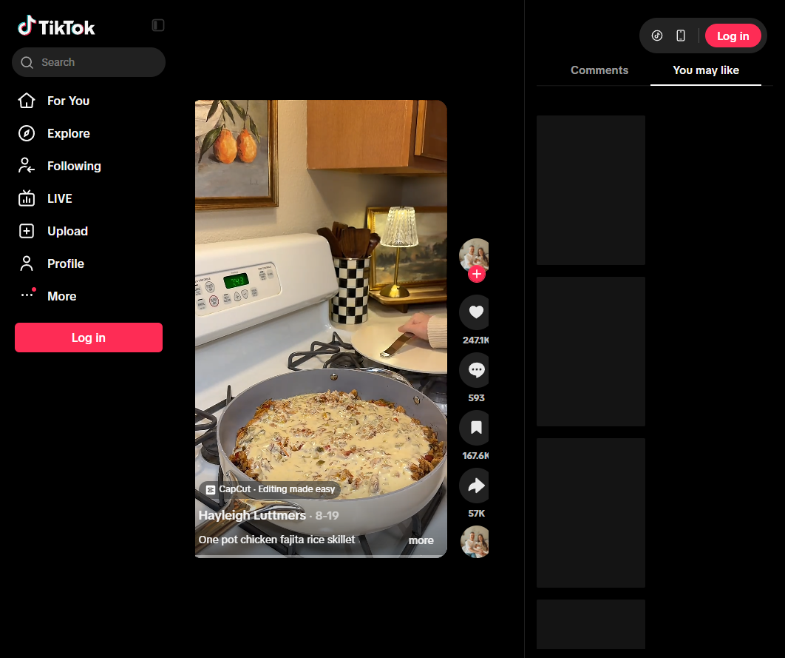

# One-Pot Chicken Fajita Rice Skillet
0032

## Ingredients

- 1 tablespoon olive oil
- 1 onion, sliced
- 3 bell peppers, sliced into strips
- 2 chicken breasts, sliced into strips
- 1 packet fajita seasoning
- 1 tablespoon minced garlic
- 1 can Rotel, undrained
- 1 cup rice, washed
- 1 teaspoon tomato bouillon
- 2 cups chicken broth
- 1 can green chiles
- 1 5-ounce can evaporated milk
- 1/2 pound white American cheese slices, from the deli

## Instructions

1. **Cook the fajitas:** Heat the olive oil in a large skillet over medium heat. Cook the onion and peppers until softened. Add chicken and fajita seasoning, then cook until the chicken is done.
2. **Add the rice:** Stir in garlic and Rotel. Add rice, chicken broth, and tomato bouillon. Bring to a boil, reduce heat to low, cover, and cook for 20 minutes, until the rice is tender and liquid is absorbed.
3. **Make the queso:** While the rice cooks, combine evaporated milk, green chiles, and white American cheese in a small saucepan over low heat. Stir until smooth.
4. **Serve:** Fluff the rice and pour the queso evenly over the top. Serve hot.

## Notes

- Source: Hayleigh Luttmers on TikTok, https://www.tiktok.com/t/ZTUDWxcqD/