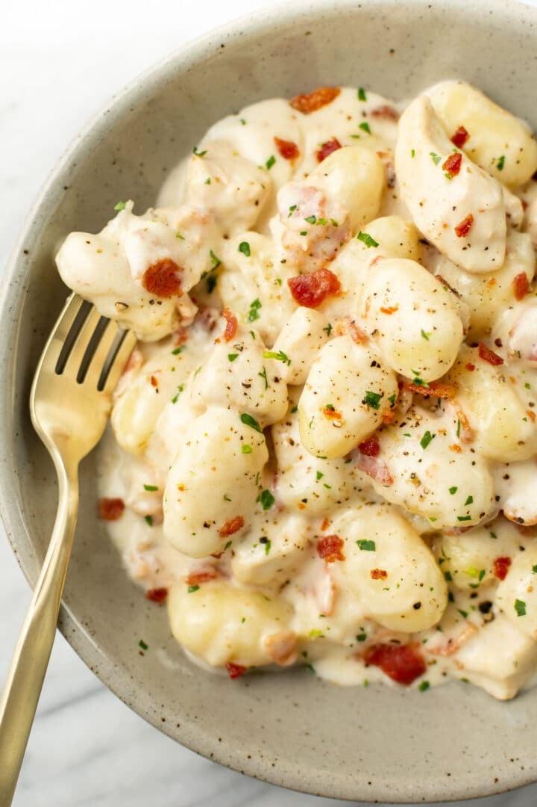

# Chicken Bacon Gnocchi
0033

## Ingredients

- 6 slices bacon, cut into small pieces
- 2 medium chicken breasts, cut into bite-size pieces
- 1 large garlic clove, minced
- 1/2 cup chicken broth
- 1 cup heavy cream
- 1/4 teaspoon Italian seasoning
- 1 pound uncooked potato gnocchi
- 1/2 cup freshly grated Parmesan cheese
- Salt and pepper, to taste

## Instructions

1. **Cook the bacon:** Heat a deep skillet over medium-high heat and cook the bacon until crispy, about 8 to 10 minutes. Remove the bacon and leave about 1 tablespoon of bacon fat in the pan.
2. **Cook the chicken:** Add the diced chicken to the skillet and cook for 2 to 3 minutes, stirring often, until it turns white on the outside.
3. **Add garlic:** Stir in the minced garlic and cook for about 30 seconds.
4. **Build the sauce:** Reduce the heat to medium. Add the chicken broth, heavy cream, Italian seasoning, gnocchi, and cooked bacon to the skillet. Stir well, cover, and cook for 4 minutes.
5. **Finish the sauce:** Uncover and continue cooking for a few more minutes, stirring occasionally, until the gnocchi is tender and the sauce thickens to your liking.
6. **Season and serve:** Stir in the Parmesan until melted, then season with salt and pepper as needed. Serve immediately.

## Notes

- Source: Salt & Lavender, https://www.saltandlavender.com/chicken-bacon-gnocchi/
- No need to pre-cook the gnocchi; it cooks right in the sauce.
