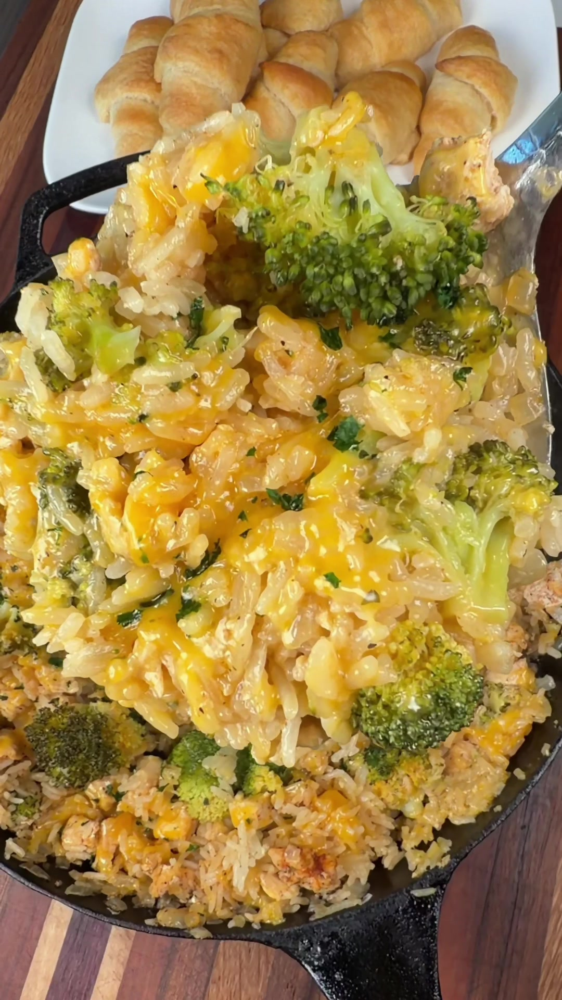

# Cheesy Broccoli, Chicken, and Rice Skillet
0034

## Ingredients

- 1 pound chicken breast, cut into small pieces
- 2 tablespoons butter
- 1 onion, chopped
- 1/2 teaspoon salt
- 1/2 teaspoon black pepper
- 1/2 teaspoon paprika
- 1 tablespoon ranch seasoning
- 1 tablespoon minced garlic
- 2 cups chicken broth
- 1 cup jasmine rice, rinsed
- 2 cups broccoli, roughly chopped
- 1 1/2 cups shredded Colby Jack cheese, divided

## Instructions

1. **Cook the chicken:** Melt the butter in a skillet over medium-high heat. Add the chicken and onion, spread them evenly in the pan, and season with salt, pepper, paprika, and ranch seasoning. Cook until the chicken is almost cooked through.
2. **Add the rice and broccoli:** Stir in the garlic, then add the rinsed rice, broccoli, and chicken broth. Bring to a boil.
3. **Simmer:** Reduce the heat to medium-low, cover, and cook for about 18 minutes, or until the rice is tender.
4. **Add the cheese:** Stir in about 1 cup of the cheese. Sprinkle the remaining cheese over the top, cover until melted, or broil for a few minutes until bubbly.

## Notes

- Source: Luke Brown (@cookinginthemidwest) on TikTok, https://www.tiktok.com/@cookinginthemidwest/video/7685028770079706399
- Avoid chopping the broccoli too finely so it does not fall apart while cooking.
