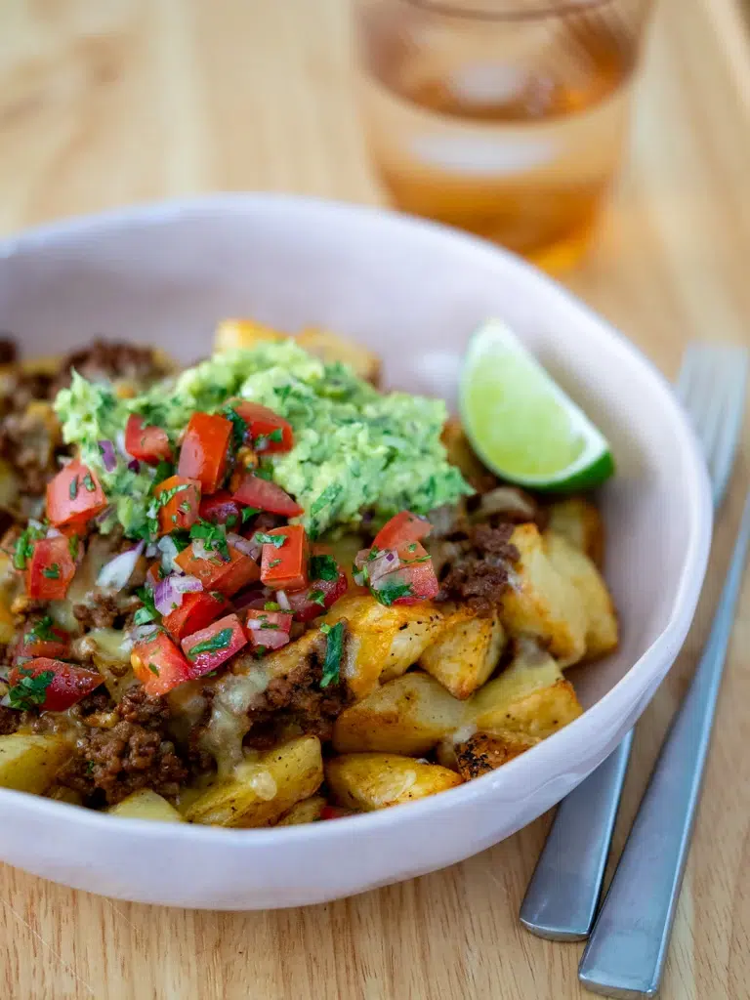

# Loaded Potato Taco Bowl
0035

## Ingredients

### Potatoes

- 700 grams potatoes, cut into 2-centimeter cubes
- 2 tablespoons extra-virgin olive oil
- 1 teaspoon sweet paprika
- 1 teaspoon garlic powder
- 1/2 teaspoon sea salt flakes
- 1/4 teaspoon freshly cracked black pepper

### Beef

- 1 tablespoon extra-virgin olive oil
- 1/2 red onion, finely chopped
- 500 grams ground beef
- 1 tablespoon sweet paprika
- 1 tablespoon ground cumin
- 1 teaspoon onion powder
- 1 teaspoon garlic powder
- 1 teaspoon dried oregano
- 1 teaspoon sea salt flakes
- 1/4 teaspoon freshly cracked black pepper
- 2 tablespoons tomato paste
- 1/4 cup water

### Guacamole

- 2 avocados, mashed
- 1/4 bunch cilantro, finely chopped
- 1/4 red onion, finely diced
- 1 lime, juiced
- 1/2 teaspoon sea salt flakes
- 1/4 teaspoon freshly cracked black pepper

### Salsa and Assembly

- 2 tomatoes, finely diced
- 1/4 bunch cilantro, finely chopped
- 1/4 red onion, finely diced
- 1 lime, juiced
- 1/2 teaspoon sea salt flakes
- 1/4 teaspoon freshly cracked black pepper
- 250 grams grated Mexican cheese blend
- Lime wedges, optional

## Instructions

1. **Roast the potatoes:** Preheat the oven to 425°F. Toss the potatoes with olive oil, paprika, garlic powder, salt, and pepper on one or two parchment-lined trays. Arrange in a single layer and bake for 40 to 45 minutes, turning halfway through, until crisp and golden.
2. **Cook the beef:** Heat the olive oil in a large skillet over medium-high heat. Cook the onion for 1 to 2 minutes, then add the beef and cook for 3 to 4 minutes, breaking it apart as it browns.
3. **Season the beef:** Add the paprika, cumin, onion powder, garlic powder, oregano, salt, and pepper. Cook for 30 seconds, then stir in the tomato paste and cook for 1 minute. Add the water and simmer over low heat for 3 to 4 minutes, until most of the liquid evaporates.
4. **Make the guacamole:** Mix all guacamole ingredients in a bowl. Cover and refrigerate until serving.
5. **Make the salsa:** Mix the tomatoes, cilantro, red onion, lime juice, salt, and pepper in a bowl. Cover and refrigerate until serving.
6. **Assemble:** Divide the potatoes among four bowls. Top with the beef, cheese, guacamole, and salsa. Serve with lime wedges, if desired.

## Notes

- Serves 4.
- Source: Simple Home Edit, https://simplehomeedit.com/recipe/loaded-potato-taco-bowl/
- To air-fry the potatoes, cook them in a single layer at 400°F for 20 to 25 minutes, shaking the basket halfway through.
