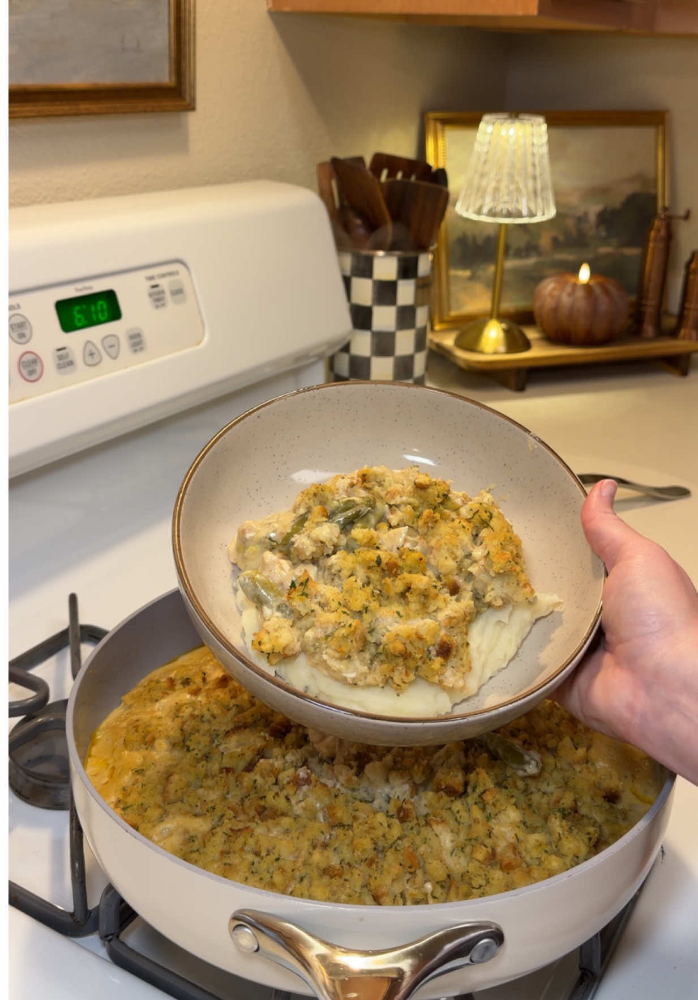

# One-Pot Chicken and Stuffing Casserole
0036

## Ingredients

### Chicken Filling

- 4 tablespoons butter
- 1 onion, chopped
- 2 celery stalks, chopped
- 1/2 cup all-purpose flour
- 1 tablespoon minced garlic
- 3 cups chicken broth
- Garlic powder, to taste
- Onion powder, to taste
- Celery salt, to taste
- Poultry seasoning, to taste
- Seasoned salt, to taste
- Black pepper, to taste
- 1 rotisserie chicken, chopped
- 1 tablespoon chicken Better Than Bouillon
- 1/2 cup heavy cream
- 1/2 cup sour cream
- 1 can green beans, drained

### Stuffing

- 4 tablespoons butter, melted
- 1 1/2 cups warm water
- 1 package chicken-flavored Stove Top stuffing mix

## Instructions

1. **Prepare the filling:** Preheat the oven to 350°F. Melt 4 tablespoons butter in an oven-safe pan over medium heat. Add the onion and celery and cook until softened.
2. **Make the sauce:** Add the flour and garlic and cook for about 2 minutes. Slowly pour in the chicken broth, stirring until combined. Season to taste with garlic powder, onion powder, celery salt, poultry seasoning, seasoned salt, and black pepper.
3. **Add the chicken:** Stir in the chicken and Better Than Bouillon, followed by the heavy cream, sour cream, and green beans.
4. **Prepare the stuffing:** Combine the melted butter, warm water, and stuffing mix in a bowl. Stir and let stand for 2 minutes.
5. **Bake:** Spread the stuffing evenly over the chicken mixture. Bake uncovered for 30 minutes.

## Notes

- Source: Hayleigh Luttmers on TikTok, https://www.tiktok.com/@hayleighluttmers/video/7681841807390559501
- Serve on its own or over mashed potatoes.
