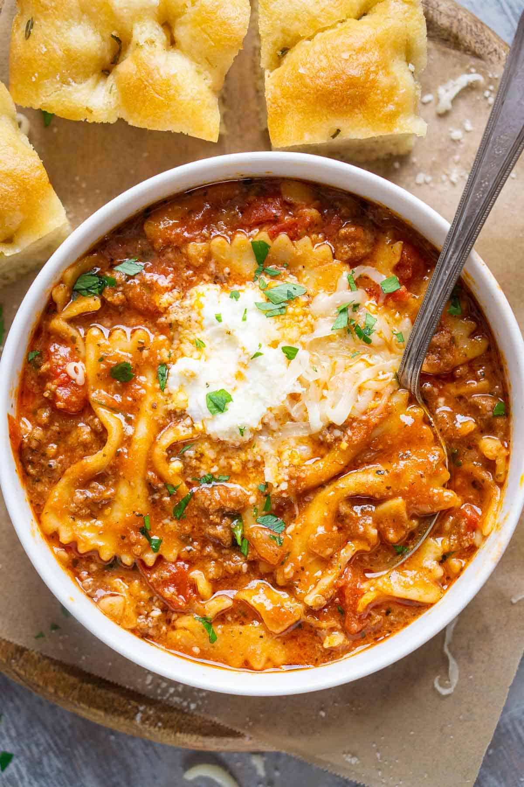

# Lasagna Soup
0038

## Ingredients

### Soup

- 1 to 2 tablespoons olive oil
- 1 pound ground beef
- 1 large onion, diced
- 4 cloves garlic, minced
- 1 (15-ounce) can diced tomatoes, undrained
- 1 (15-ounce) can tomato sauce or tomato puree
- 1/3 cup tomato paste
- 4 cups chicken broth
- 1 to 2 cups water, as needed
- 1 tablespoon Italian seasoning
- 1 teaspoon salt, plus more to taste
- Black pepper, to taste
- 8 ounces uncooked bowtie pasta or another sturdy pasta

### Toppings

- 1/2 cup ricotta cheese
- 2 ounces mozzarella cheese, shredded (about 1/2 cup)
- 1/4 cup Parmesan cheese, shaved, shredded, or freshly grated
- 1/4 cup fresh parsley, chopped

## Instructions

1. **Brown the beef:** Heat a large soup pot over medium-high heat. Add the olive oil and heat until shimmering. Add the ground beef, onion, and garlic. Cook until the beef is browned and the onion is softened, stirring as needed. Drain any excess fat.
2. **Build the soup:** Stir in the diced tomatoes and their juice, tomato sauce, tomato paste, chicken broth, Italian seasoning, salt, black pepper, and pasta.
3. **Cook the pasta:** Increase the heat to high and bring the soup to a boil. Reduce to a medium simmer and cook for 10 to 15 minutes, stirring frequently, until the pasta is tender. Add water or more broth in small amounts as needed to reach the desired consistency.
4. **Serve:** Let the soup cool slightly, then stir the ricotta, mozzarella, and Parmesan into the pot, or serve the cheeses on the side for adding to individual bowls. Garnish with fresh parsley.

## Notes

- Yield: 12 cups.
- Source: The Kitchen Girl, https://thekitchengirl.com/lasagna-soup/
- Bowtie, macaroni, rigatoni, and penne hold up well for leftovers. Broken lasagna noodles can also be used but soften more quickly.
- Any ground meat can be substituted for the ground beef.
- For a thicker broth, use crushed tomatoes instead of diced tomatoes.
- Refrigerate in an airtight container for up to 5 days or freeze for up to 3 months. Add broth or water when reheating because the pasta will continue to absorb liquid.
